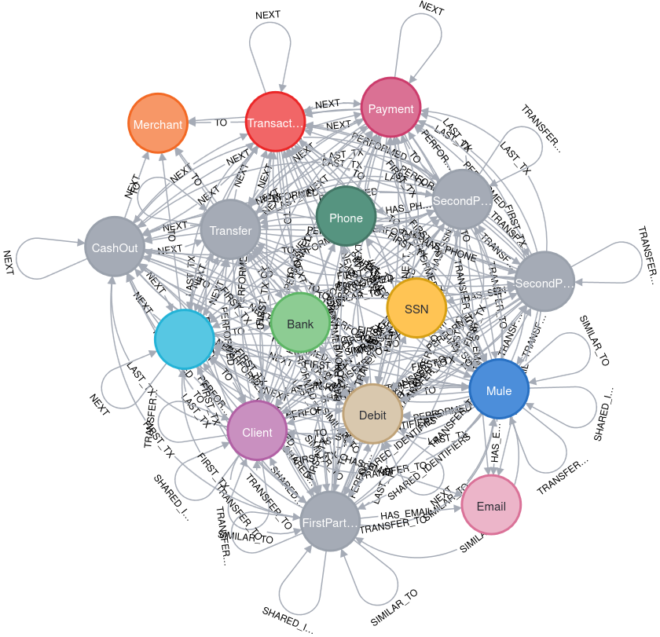

# Analyse the Fraud Detection dataset including

## 1. Schema visualization
Command:
```cypher
CALL db.schema.visualization()
```
Output:


## 2. Node count
Command:
```cypher
MATCH (n)
RETURN count(n)
```
Output:
```plaintext
╒════════╕
│count(n)│
╞════════╡
│332973  │
└────────┘
```
## 3. Relationship count
Command:
```cypher
MATCH ()-[r]->()
RETURN count(r)
```
Output:
```plaintext
╒════════╕
│count(r)│
╞════════╡
│980098  │
└────────┘
```
## 4. Node labels and their count
Command:
```cypher
CALL db.labels() YIELD label
CALL apoc.cypher.run('MATCH (:`'+label+'`) RETURN count(*) as count', {})
YIELD value
RETURN label as Label, value.count AS Count
```
Output:
```plaintext
╒═════════════╤══════╕
│Label        │Count │
╞═════════════╪══════╡
│"Client"     │2433  │
├─────────────┼──────┤
│"Bank"       │3     │
├─────────────┼──────┤
│"Merchant"   │347   │
├─────────────┼──────┤
│"Mule"       │433   │
├─────────────┼──────┤
│"CashIn"     │149037│
├─────────────┼──────┤
│"CashOut"    │76023 │
├─────────────┼──────┤
│"Debit"      │4392  │
├─────────────┼──────┤
│"Payment"    │74577 │
├─────────────┼──────┤
│"Transfer"   │19460 │
├─────────────┼──────┤
│"Transaction"│323489│
├─────────────┼──────┤
│"Email"      │2229  │
├─────────────┼──────┤
│"SSN"        │2238  │
├─────────────┼──────┤
│"Phone"      │2234  │
└─────────────┴──────┘
```
## 5. Relationship types and their count
Command:
```cypher
MATCH ()-[r]->()
RETURN TYPE(r) AS type, COUNT(relationship) AS count
ORDER BY count DESC;
```
Output:
```plaintext
╒═══════════╤═══════════╕
│type       │value.count│
╞═══════════╪═══════════╡
│"PERFORMED"│323489     │
├───────────┼───────────┤
│"TO"       │323489     │
├───────────┼───────────┤
│"HAS_SSN"  │2433       │
├───────────┼───────────┤
│"HAS_EMAIL"│2433       │
├───────────┼───────────┤
│"HAS_PHONE"│2433       │
├───────────┼───────────┤
│"FIRST_TX" │2332       │
├───────────┼───────────┤
│"LAST_TX"  │2332       │
├───────────┼───────────┤
│"NEXT"     │321157     │
└───────────┴───────────┘
```
## 5: Find out what types of transactions do these Clients perform with first party fraudsters?
Command:
```cypher
MATCH (:Client:FirstPartyFraudster)-[]-(txn:Transaction)-[]-(c:Client)
WHERE NOT c:FirstPartyFraudster
UNWIND labels(txn) AS transactionType
RETURN transactionType, count(*) AS freq
```
Spark log:
```plaintext
+---------------+----+
|transactionType|freq|
+---------------+----+
|       Transfer|  89|
|    Transaction|  89|
+---------------+----+
```

See code at [./spark/src/main/scala/Neo4jToSpark.scala](./spark/src/main/scala/Neo4jToSpark.scala).

## 6: How many clusters of FraudRings with greater than 9 client nodes?

Command:
```cypher
MATCH (c:Client)
WITH c.firstPartyFraudGroup AS fpGroupID, collect(c.id) AS fGroup
WITH *, size(fGroup) AS groupSize WHERE groupSize > 9
WITH collect(fpGroupID) AS fraudRings
MATCH p=(c:Client)-[:HAS_SSN|HAS_EMAIL|HAS_PHONE]->()
WHERE c.firstPartyFraudGroup IN fraudRings
RETURN p
```
Graph:


Command for number of groups:
```cypher
MATCH (c:Client)
WITH c.firstPartyFraudGroup AS fpGroupID, collect(c.id) AS fGroup
WITH *, size(fGroup) AS groupSize WHERE groupSize > 9
WITH collect(fpGroupID) AS fraudRings
MATCH p=(c:Client)-[:HAS_SSN|HAS_EMAIL|HAS_PHONE]->()
WHERE c.firstPartyFraudGroup IN fraudRings
RETURN count(DISTINCT c.firstPartyFraudGroup) as groupCount
```
Output:
```plaintext
╒══════════╕
│groupCount│
╞══════════╡
│5         │
└──────────┘
```

## 7: How many clusters of FraudRings with greater than 10 client nodes?

Command:
```cypher
MATCH (c:Client)
WITH c.firstPartyFraudGroup AS fpGroupID, collect(c.id) AS fGroup
WITH *, size(fGroup) AS groupSize WHERE groupSize > 10
WITH collect(fpGroupID) AS fraudRings
MATCH p=(c:Client)-[:HAS_SSN|HAS_EMAIL|HAS_PHONE]->()
WHERE c.firstPartyFraudGroup IN fraudRings
RETURN p
```

Graph:


Command for number of groups:
```cypher
MATCH (c:Client)
WITH c.firstPartyFraudGroup AS fpGroupID, collect(c.id) AS fGroup
WITH *, size(fGroup) AS groupSize WHERE groupSize > 10
WITH collect(fpGroupID) AS fraudRings
MATCH p=(c:Client)-[:HAS_SSN|HAS_EMAIL|HAS_PHONE]->()
WHERE c.firstPartyFraudGroup IN fraudRings
RETURN count(DISTINCT c.firstPartyFraudGroup) as groupCount
```
Output:
```plaintext
╒══════════╕
│groupCount│
╞══════════╡
│3         │
└──────────┘
```
